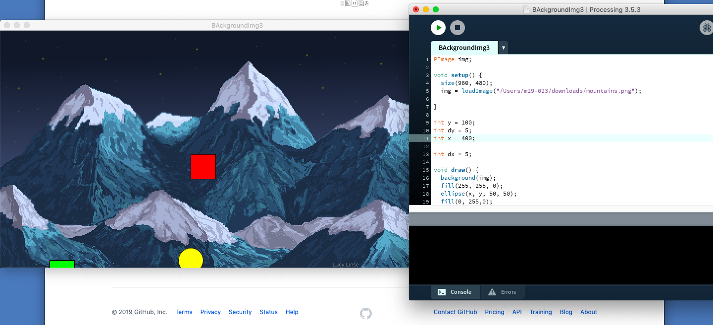

# Homework Nov 8th


# Last JOurnal

Programing with software Processing. Thoughout this program, my task is to draw a rectangle with four circles on each corner. Indeed, this program as all program will be work on some fonctions. In this case, i would like to use size and background as usually used to deterine the heigth and the color of the canvas, the functionality will be shown below these sentences. To program with processing we need differents punctuation marks to allow the successful work of the program such as semicolon(;), comma(,) and round brackets(). Also we use the positive numbers to fix in background and size. Warning with uppercase letters which can't allow the program to be executed.

background(0,255,255);
size(500,500);
Concerning the task of draw, i still used the fonction "line" which allows to draw vertical or horintal lignes in the canvas.By definition, a line (AB) is constituted by an infinity of points between a starting point A and a point of arrival B. To construct it, we will be interested only in the x and y coordinates of A and B. Thus if, for example in the default window, point A is in the region at the bottom left of your window, and point B is at the top right, the following instructions can draw this line as: line(xA, yA, xB, yB):

line(100,50,100,400);
line(400,50,400,400);
line(100,400,400,400);
line(100,50,400,50);
this one is used to draw the rectangle in the picture attached below.

fill(0);
circle(100,75,75);
here i combined the functions fill and circle to fix the circle at the corner of my rectangle.

programOfBigSquare

```
size(500,500);
background(0,0,255);

for(int i=0;i<8;i++){
  rect(50,400-50*i,50,50);
}

for(int i=0;i<2;i++){
  rect(100+50*i,50,50,50);
}

for(int i=0;i<2;i++){
  rect(100+50*i,400,50,50);
}

for(int i=0;i<8;i++){
  rect(250,400-50*i,50,50);
}

for(int i=0;i<3;i++){
  rect(300+50*i,50,50,50);
}

for(int i=0;i<3;i++){
  rect(400,100+50*i,50,50);
}

for(int i=0;i<2;i++){
  rect(300+50*i,200,50,50);
}
```
## Traffic Light


## program image on background



Thursday, December 12th 2019

TOPIC1 - SYSTEM FUNDAMENTALS

#System life cycle:
  Systematic process, know as a system life cycle, refers to the stages through which the development of a new system passes through. indeed, the system life cycle is constitued of six stages which are following each others: planning, design, development, testing, implementation and evaluation. each of these stages are complementary which means that without one we cannot talk about the SLC. By the way, to create a good software, it is important or mostly important not to jump one of each stages. It may be appropriate to say, the goal of the system life cycle acronym SLC is to create a software. In the followinfg articles, the figure1.1 shows a SLC especially for software whereas the figure1.2 presents it more general.
  
  Figure1.1: Software life cycle
    Here the SLC works like the following steps show: Existing system analysis, then requirements specification, software design, software implementation, testing and debugging, new system installation and finally maintenance. As said on the top that this figure presents almost the SLC of software. It starts with the inspection of the old system or to say clear the existing one, then so on like quoted.
    
Figure1.2: System life cycle
  this one is more short and usable whenever for the system life cycle, it is working like this: begin with make an analysis, after that it will be important to design the issue, implementation, operation and to finish with maintenance. By extension, some stages work by planning and analysing, then design the overview, so develop it and quickly evaluate it.
  
  1.1 Systems in organizations:
    planning and system installation
    
    When we think about to create a new system, that is in order to replace the one that exist and which is inefficient, no longer prospitious to satisfy its original purpose, or else out-dated. The new system created, will take over the functuonalities. Its purpose will be to increase the productivy or the quality of the output or else minimize costs. What means the new system should reduce the flaws or errors of the existing one.  
    
    1.1.2 The need for change management:
    change management is a process of shifting individuals, teams, departments and organizations from the prresent state to a desired state. Here the goal is to maximize the benefits and minimize the negative impacts of change on individuals.
    
    
 WEDNESDAY, 12TH   
  user = {'Username': None, 'password-hash': None, 'salt': None}

print("1 - Register")
print("2 - Log In")
print("3 - Exit")

opt = 10
while opt > 13:
    opt = int(input("Enter option (1, 2, or 3) "))

#Registration
username = input('Enter usrname: ')

confirmed = False
while not confirmed:
    password = input('Enter password: ')
    c_password = input("Confirm your password: ")

    # confirmed = True if password == c_password else False
    if password == c_password:
        confirmed = True

print("Password confirmed")
import os
import hashlib
salt = os.urandom(32) # this creates a 32 bytes
key = hashlib.pbkdf2_hmac('sha256', password.encode('utf-8'), salt, 1000)

import binascii
print(binascii.hexlify(key))

STEPS REGISTER
- input username
-input password
-input password confirmation
-encoding of the password
  "Hash Sha-256"
  
  
Thursday, february 13th 2020


# read the text from the file
file = open("text.txt", "r")

extract = file.read()

words = extract.split()
print("number oSf words is {}".format(len(words)))


keywords = ['house', 'worker', 'master', 'hard', 'responsible', 'skillful']
for key in keywords:
    print("checking word" + key + "in the text: found")
    print(key in words)

lengthOfText = len(extract)
# using C thinking
num_letters = 0
for symbol in extract:
    if symbol.isalpha():
        num_letters = num_letters + 1
print(f'There are  {num_letters} out of {lengthOfText} total characters')

print(extract.capitalize())

def checkLen(x):
    if len(x)>5:
        return True
    else:
        return False

long_words = '# '.join(list(filter(lambda a: len(a)>5, words)))
print(long_words)

for word in words:
    if len(word) > 5:
        print('#' + word)

from functools import reduce
totalSumPythonic = reduce(lambda a,b: a+b, [ord(e) for e in extract])
print(totalSumPythonic)

totalSum = 0
for l in extract:
    totalSum += ord(l)
