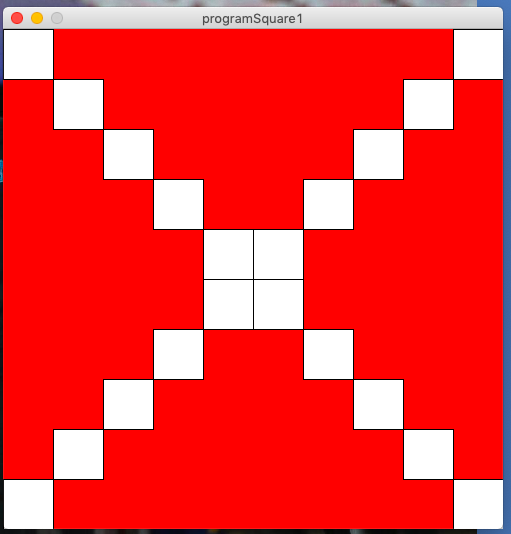

# First program with Processing

The following code is doing ....
```.c
size(500,500);
background(0,255,0);
```

```.c
for(int i=0;i<10;i++){
  println("Square y=", i);
  rect(0,350-50*i,50,50);
}
```

New program creates the image below

To create this program I used the code below:
```.c
size(500,500);
background(255,0,0); 
```
These fonctions are useful to make a program because firstly we use "size" so that to fix the boundaries of our canvas which allows to see the resultats of our code; finally, background is used to change the color of the canevas and the maximum number of color on background is "255". Also there are some colors such as: red, green, blue, white and gray.

```.c
for(int i=0;i<10;i++){
rect(0,0,50,50);
}
```
the whole work is focused around the following steps: to fix the starting points(X,Y) and the Width includes the height, all in the fonction rect. "For" is used to indicate the numbers of square can multiply.
Each time that we change the, we have to change the starting points and over working kept the same values for the width and the height.
