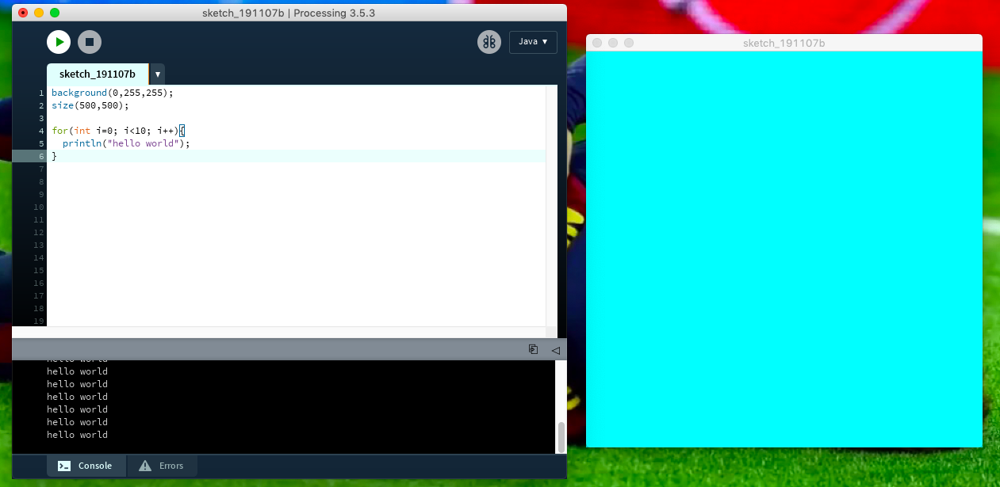

This program is a creative of the code in which the message will be repeat. So known every program start by fix the commands which will be executed by the computer. Also there's an attached picture of all the task.

to bebin with, while all tfhis work i'm working with four(4) fonctions which will allow the execution of this code.
```
background(0,255,255);
size(500,500);
```
both of these two fonctins are the starting one which allow to determine the the color and the height of the canvas. Canvas is a small window that displays each time when we open Processing. And it goal is to show the result of our program. So it's dimension and color dedpend of the fonction "size" which determines the heigth and "background" which fix the color. It is always important to use << , ; >> however the program can't work include the << () >>.
```
for(int i=0; i<10; i++){
  println("hello world");
}
```
here's two last points of this program which is on the repetition of the text. So i used "for" so that to indicate the loop of the message below the sketch; Finally "println" is the fonction used in processing to dislay the text, it's constfitued of << "" () >>.
