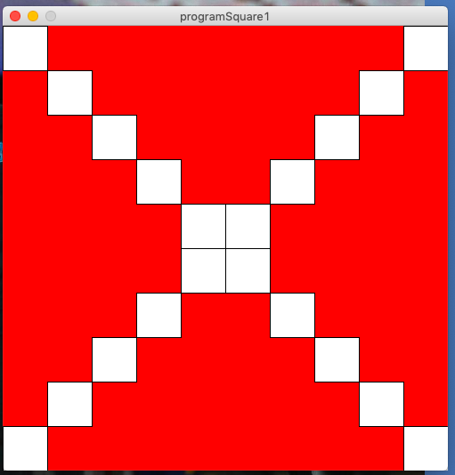

# First program with Processing

The following code is doing ....
```.c
size(500,500);
background(0,255,0);
```

```.c
for(int i=0;i<10;i++){
  println("Square y=", i);
  rect(0,350-50*i,50,50);
}
```

New program creates the image below

