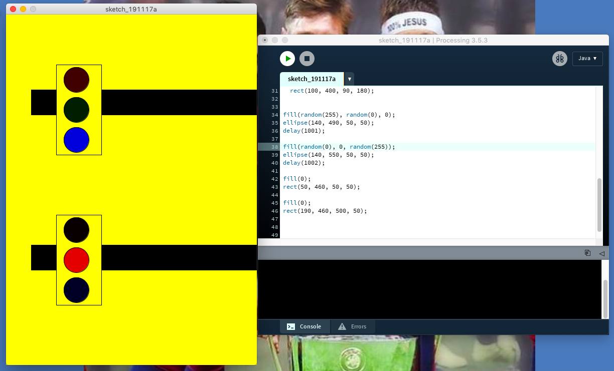

# Homework Nov 8th


# Last JOurnal

Programing with software Processing. Thoughout this program, my task is to draw a rectangle with four circles on each corner. Indeed, this program as all program will be work on some fonctions. In this case, i would like to use size and background as usually used to deterine the heigth and the color of the canvas, the functionality will be shown below these sentences. To program with processing we need differents punctuation marks to allow the successful work of the program such as semicolon(;), comma(,) and round brackets(). Also we use the positive numbers to fix in background and size. Warning with uppercase letters which can't allow the program to be executed.

background(0,255,255);
size(500,500);
Concerning the task of draw, i still used the fonction "line" which allows to draw vertical or horintal lignes in the canvas.By definition, a line (AB) is constituted by an infinity of points between a starting point A and a point of arrival B. To construct it, we will be interested only in the x and y coordinates of A and B. Thus if, for example in the default window, point A is in the region at the bottom left of your window, and point B is at the top right, the following instructions can draw this line as: line(xA, yA, xB, yB):

line(100,50,100,400);
line(400,50,400,400);
line(100,400,400,400);
line(100,50,400,50);
this one is used to draw the rectangle in the picture attached below.

fill(0);
circle(100,75,75);
here i combined the functions fill and circle to fix the circle at the corner of my rectangle.

programOfBigSquare

```
size(500,500);
background(0,0,255);

for(int i=0;i<8;i++){
  rect(50,400-50*i,50,50);
}

for(int i=0;i<2;i++){
  rect(100+50*i,50,50,50);
}

for(int i=0;i<2;i++){
  rect(100+50*i,400,50,50);
}

for(int i=0;i<8;i++){
  rect(250,400-50*i,50,50);
}

for(int i=0;i<3;i++){
  rect(300+50*i,50,50,50);
}

for(int i=0;i<3;i++){
  rect(400,100+50*i,50,50);
}

for(int i=0;i<2;i++){
  rect(300+50*i,200,50,50);
}
```
## Traffic Light

